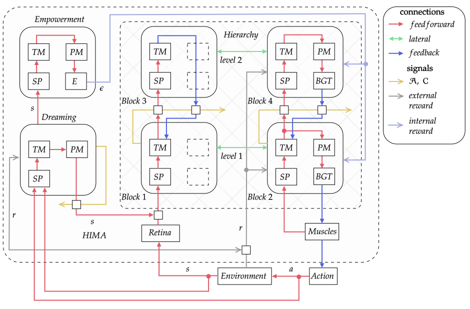

# Hierarchical Intrinsically Motivated Agent - HIMA

[](https://doi.org/10.5281/zenodo.7133430)

- [Hierarchical Intrinsically Motivated Agent - HIMA](#hierarchical-intrinsically-motivated-agent---hima)
  - [The Repository](#the-repository)
  - [Hierarchical Intrinsically Motivated Agent](#hierarchical-intrinsically-motivated-agent)
  - [Links](#links)
  - [Quick install](#quick-install)
  - [Repository structure](#repository-structure)
  - [Run examples](#run-examples)
    - [How to run HIMA agent](#how-to-run-hima-agent)
    - [Run one experiment](#run-one-experiment)
    - [Run Sweep](#run-sweep)
  - [Cite us](#cite-us)
  - [License](#license)

## The Repository

This repository ("Hierarchical Intrinsically Motivated Agent - HIMA") is where we (AIRI and MIPT) publicate the source code of the HIMA model. This source code is available to everyone under [AGPLv3](./LICENSE) license.

## Hierarchical Intrinsically Motivated Agent

The Hierarchical Intrinsically Motivated Agent (HIMA) is an algorithm that is intended to exhibit an adaptive goal-directed behavior using neurophysiological models of the neocortex, basal ganglia, and thalamus:

- The neocortex model is used to form hierarchical internal representations of raw sensory input and a model of the environment.
- The basal ganglia model provides an association of internal representations projected from the neocortex with rewarding signals and selects appropriate actions via thalamocortical loops.
- The Dreaming component models circuits of the brain responsible for the initiation of planning via the model of the environment in the neocortex, improving the learning speed.
- The Empowerment module is in charge of producing intrinsic motivation signal utilizing the environmental model learned by the neocortex to guide exploration to the most promising states first.

A detailed description of HIMA model is provided in the [supporting paper](http://dx.doi.org/10.1186/s40708-022-00156-6).



## Links

- Supporting [paper](http://dx.doi.org/10.1186/s40708-022-00156-6)
- Contributors [guide](./CONTRIBUTING.md)
- Introductory [materials](./intro.md)

## Quick install

There're two setup guides:

- [quick & short version](#quick-install) is here below.
- [extended version](./install.md).

Before cloning the repository, make sure Git LFS is installed (see [help](./install.md#step-2-install-git-lfs)). Then:

```bash
# create new env with the required packages via conda, then activate it
conda create --name hima python=3.9 numpy matplotlib jupyterlab ruamel.yaml tqdm wandb mock imageio seaborn
conda activate hima

# install with pip the packages that cannot be installed with conda
pip install hexy prettytable "pytest>=4.6.5"

# git clone our `htm.core` fork to an arbitrary place and pip install it from sources
# pip will install missing dependencies to the current environment if needed
cd <where to clone>
git clone https://github.com/ZhekaHauska/htm.core.git
cd htm.core
pip install .

#  cd to the hima subdirectory in the project root and install hima package
cd <hima_project_root>
pip install -e .
```

## Repository structure

- `hima/` - HIMA package sources

## Run examples

### How to run HIMA agent

Sign up to [wandb](https://wandb.ai/) and get access token in your profile settings to authorize locally further on.

### Run one experiment

``` bash
# cd to the package sources root
cd <hima_project_root>/hima

# cd to the hima experiments directory
cd experiments/hima/scripts

# replace <config name> with the config filename without extension
python run_agent.py <environment>/<config_name>
```

Do not forget to change `entity` parameter in the corresponding config file to match your [wandb](https://wandb.ai/) login. When wandb asks you to login for the first time, use your access token obtained earlier.

### Run Sweep

Wandb [sweep](https://docs.wandb.ai/guides/sweeps) runs series of experiments with different seeds and parameters.

```bash
# cd to the package sources root
cd <hima_project_root>/hima

# cd to the hima experiments directory
cd experiments/hima

# replace <sweep config name> with the sweep config filename without extension
wandb sweep sweep/<sweep config name>

# replace <sweep id> with the returned id
python scripts/run_agents.py -n n_processes -c "wandb agent <sweep id>"
```

## Cite us

If you use this repository in your research or wish to cite it, please make a reference to this piece of software:

```latex
@software{petr_kuderov_2022_7133430,
  author       = {Petr Kuderov and
                  Evgenij Dzhivelikyan and
                  Artem Latyshev and
                  Aleksandr I. Panov},
  title        = {{AIRI-Institute/him-agent: Hierarchical 
                   Intrinsically Motivated Agent Planning Behavior
                   with Dreaming in Grid Environments}},
  month        = mar,
  year         = 2022,
  publisher    = {Zenodo},
  version      = {v3.2-hima-airi},
  doi          = {10.5281/zenodo.7133430},
  url          = {https://doi.org/10.5281/zenodo.7133430}
}
```

or to the supporting paper:

```latex
@article{Dzhivelikian_Latyshev_Kuderov_Panov_2022,
  title        = {Hierarchical intrinsically motivated agent planning behavior with dreaming in grid environments},
  volume       = {9},
  rights       = {All rights reserved},
  issn         = {2198-4026},
  doi          = {10.1186/s40708-022-00156-6},
  number       = {1},
  journal      = {Brain Informatics},
  author       = {Dzhivelikian, Evgenii and Latyshev, Artem and Kuderov, Petr and Panov, Aleksandr I.},
  year         = {2022},
  month        = {Apr},
  pages        = {8},
```

## License

© 2022 Autonomous Non-Profit Organization "Artificial Intelligence Research Institute" (AIRI); Moscow Institute of Physics and Technology (National Research University). All rights reserved.

Licensed under the [AGPLv3](./LICENSE) license.
